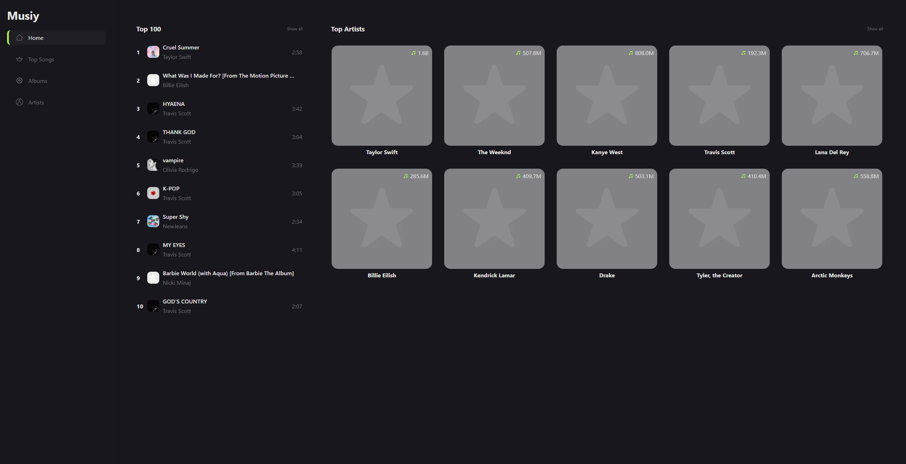

<div align="center">
  
</div>
<h1 align="center">
  Musiy
</h1>
<p align="center">
  Simple music application containing information about top artists, albums, labels, etc. It is built on open <a href="https://github.com/exogen/graphbrainz" target="_blank">GraphQL API</a> which provides an interface to <a href="https://musicbrainz.org/" target="_blank">MusicBrainz</a> REST API.
</p>
<p align="center">
    
</p>



## Used

* [TypeScript](https://www.typescriptlang.org/)
* [React](https://reactjs.org/)
* [Apollo](https://www.apollographql.com/)
* [Vite](https://vitejs.dev/)

## Project setup
```
npm install
```

### Compiles and hot-reloads for development
```
npm run dev
```

### Compiles and minifies for production
```
npm run build
```

### Once you've built the app, you may test it locally
```
npm run preview
```
